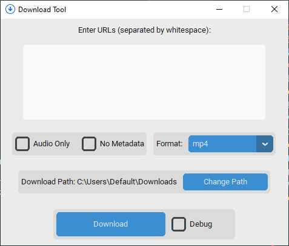

# downloader

A simple [yt-dlp](https://github.com/yt-dlp/yt-dlp) wrapper written in Python.

- [Terminal](#terminal)
- [User Interface](#user-interface)
- [Supported Formats](#supported-formats)
  - [Supported audio formats](#supported-audio-formats)
  - [Supported video formats](#supported-video-formats)
- [Requirements](#requirements)
- [Building Executable](#building-executable)
- [License](#license)

## Terminal

```plaintext
usage: main.py [-h] [-d DOWNLOAD_FOLDER] [-a] [--no-metadata] [-f FORMAT] [--ui] [urls ...]

Download audio and video from YouTube links

positional arguments:
  urls                  YouTube links

options:
  -h, --help            show this help message and exit
  -d DOWNLOAD_FOLDER, --download-folder DOWNLOAD_FOLDER
                        download folder
  -a, --audio_only      download only audio
  --no-metadata         don't add subtitles, metadata and cover art to downloaded files
  -f FORMAT, --format FORMAT
                        download format
  --ui                  run UI instead of command line
```

If no arguments are specified, it'll open the UI.

For bash, you can use `downloader`, which is just a shortcut for `python main.py`.

## User Interface




(theme depends on system settings)

## Supported Formats

### Supported audio formats

- `aac` (downloads in an `m4a` container)
- `alac` (downloads in an `m4a` container)
- `flac`
- `m4a`
- `mp3`
- `opus`
- `vorbis` (downloads in an `ogg` container)
- `wav`

### Supported video formats

- `avi`
- `flv`
- `mkv`
- `mp4`

(`mov` and `webm` aren't supported because of [yt-dlp issue #4838](https://github.com/yt-dlp/yt-dlp/issues/4838))

## Requirements

Ensure you have the necessary dependencies installed by running:

```bash
pip install -r requirements.txt
```

## Building Executable

To build the `downloader.exe` executable, use the `downloader.spec` file. Ensure you have the following executables in your environment:

- `ffmpeg`
- `ffprobe`
- `yt-dlp`

You can specify the paths to these executables in a `.env` file using the following keys:

- `FFMPEG_PATH`
- `FFPROBE_PATH`
- `YT_DLP_PATH`

To create the executable, run the following command (make sure you have `pyinstaller` installed):

```bash
pyinstaller --noconfirm .\downloader.spec
```

## License

This project is licensed under the [MIT License](LICENSE.md).
